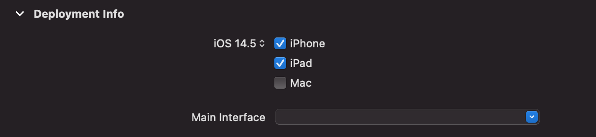

# Programmatic UITableView

This is an app made following the [tutorial](https://youtube.com/playlist?list=PLJbKhtS4qyYR7WSqTs5V0B0xx3iH7_Iyo) created by Martin Lasek on creating a UITableView without the use of storyboards.

<p align="center">
    
</p>

## Delete Storyboard
Delete Storyboard.main

Delete Reference to Main in General > Deployment Info > Main Interface



## Change the start of the App Code

On iOS 12 the AppDelegate should look like this:
```
@UIApplicationMain
class AppDelegate: UIResponder, UIApplicationDelegate {

    var window: UIWindow?

    func application(_ application: UIApplication, didFinishLaunchingWithOptions launchOptions: [UIApplication.LaunchOptionsKey: Any]?) -> Bool {

        window = UIWindow(frame: UIScreen.main.bounds)
        window?.rootViewController = AmiiboListVC()
        window?.makeKeyAndVisisble()

        return true
    }

}
```

On iOS 13 the AppDelegate should look like this:
```
@main
class AppDelegate: UIResponder, UIApplicationDelegate {

    func application(_ application: UIApplication, didFinishingLaunchingWithOptions launchOptions: [UIApplication.LaunchOptionsKey:Any]) -> Bool {
        return true
    }

    // MARK: UISceneSession Lifecycle

    func application(_ application: UIApplication, configurationForConnecting connectingSceneSession: UISceneSession, options: UIScene.ConnectionOptions) -> UISceneConfiguration {
        // Called when a new scene session is being created.
        // Use this method to select a configuration to create the new scene with.
        return UISceneConfiguration(name: "Default Configuration", sessionRole: connectingSessionRole.role)
    }

    func application(_ application: UIApplication, didDiscardSceneSessions sceneSessions: Set<UISceneSession>) {
        // Called when a user discards a scene session.
        // If any sessions were discarded while the application was not running, this will be called shortly after application:didFinishLaunchingWithOptions.
        // Use this method to release any resources that were specific to the discarded scenes, as they will not return.
    }
}
```

The SceneDelegate would take the UIWindow object and should look like this:
```
class SceneDelegate: UIResponder, UIWindowSceneDelegate {

    var window: UIWindow?

    func scene(_ scene: UIScene, sceneWillConnectTo: session: UISceneSession, options connectionOptions: UIScene.ConnectionOptions) {
        // Use this method to optionally configure and attach the UIWindow `window` to the provided UIWindowScene `scene`.
        // If using a storyboard, the `window` property will automatically be initialized and attached to the scene.
        // This delegate does not imply the connecting scene or session are new (see `application:configurationForconnectingSceneSession` instead).
        guard let windowScene = (scene as? UIWindowScene) else { return }
        window = UIWindow(frame: windowScene.coordinateSpace.bounds)
        window?.windowScene = windowScene
        window?.rootViewController = AmiiboListVC()
        window?.makeKeyAndVisible()
    }

    func sceneDidDisconnect(_ scene: UIScene) {}

    func sceneDidBecomeActive(_ scene: UIScene) {}

    func sceneWillResignActive(_ scene: UIScene) {}

    func sceneWillEnterForeground(_ scene: UIScene) {}

    func sceneDidEnterBackground(_ scene: UIScene) {}
}
```
